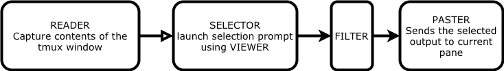

tmux-butler
-----------
tmux-butler runs a collection of scripts to help you copy paste any visible text in your tmux window using fzf.


Requirements
------------
- [tmux](https://github.com/tmux/tmux)
    - to capture the pane contents
    - to send strings to the current pane
    - to spawn a tmux split window ( or a popup: only in tmux master ) to show the fzf selector
- [fzf](https://github.com/junegunn/fzf)
    - to launch a fuzzy selector for the user to interactively select a string

Installation
-----

```sh
git clone --depth 1 https://github.com/woodstok/tmux-butler ~/.tmux-butler
```
tmux-butler is made to be used via tmux keybindings.
Add the following to your `~/.tmux.conf`:
```
bind-key -n M-i run-shell -b "$HOME/.tmux-butler/tmux-butler"
```
Reload `~/.tmux.conf` by running 
```
$ tmux source-file ~/.tmux.conf
```
Usage
-----
<kbd>Meta</kbd> + <kbd>I</kbd> will invoke tmux-butler.  

By default tmux-butler 
* Captures text from all the visible panes
* Opens up the quetty script in a tmux split-window. quetty is a wrapper over fzf with a few in-built keyboard shortcuts that help to quickly filter text based on regex.  eg: 
    - <kbd>Ctrl</kbd>+<kbd>p</kbd> - Will display only text that matches path regex
    - <kbd>Ctrl</kbd>+<kbd>h</kbd> - Will display only text that are hashes
    - <kbd>Ctrl</kbd>+<kbd>i</kbd> - Will display only text that are ip addresses and prefixes
* If anything was selected, send/paste the contents to the tmux pane we started from

The stages
--------------


tmux-butler butler has three main stages and a few helper scripts. 
#### READER ####
The Reader stage supplies input to be processed by later stages.
By default READER is the capture_panes script which simply dumps all the pane contents to stdout. 

#### SELECTOR ####
In Selector stage, user is prompted with a selector screen ( usually fzf based ) to let the user select strings using very few key strokes. 
By default, SELECTOR is the quetty-fzf script which is a fancy fzf wrapper with a few added key-bindings that automatically tokenize the input to common tokens like hashes, numbers, ip addresses, words without any space etc.

#### VIEWER ####
VIEWER script is responsible to display the SELECTOR command. It gives the option to customize how the selection window is displayed. eg: tmux split-window, tmux popup, a new terminal window etc. New custom viewers can be defined in `viewers` directory.

NOTE: The tmux-popup option shown in the preview is currently only available in `tmux:master`. 

#### FILTER ####
Once the user makes a selection during the SELECTOR stage, the FILTER stage can be used to do any final processing before its sent to the screen. This is particularly useful if we are only selecting a key whose value has to be further looked up in a collection.
By default, FILTER is the cat command which passes the selection without any changes.

#### PASTER ####
Paster finally sends the selected and filtered output to the current pane. 
By default, it uses the inbuilt paste-to-tmux script, but it could easily by changed to
sending the output to  your system clipboard or anywhere you want it to be. They are all bash scripts after all. 

### Other helper scripts ###
#### quetty ####
quetty is the default SELECTOR used. quetty filters the input and dumps out strings that matches the specified regexes and custom filters. It has a few inbuilt tokenizers like 

hash - hash values 
ip - ip addresses and ip prefixes
nospace - strings that match \S+
num - numbers
word - strings that match \w+
path - filesystem path like strings
quote - entire single and double quoted strings

In addition to these, user can provide custom filters by using the 
-regex REGEX keyword
-\<custom> 
  where <custom> is a script placed inside the `filters` folder that reads from stdin, 
  does custom filtering and prints to stdout.
eg: -path is a custom filter. Take a look at the `fitlers/path` script for a simple custom filter implementation

##### quetty-fzf #####
A helper script that combines different tokenizers of quetty with fzf.
quetty-fzf sends the input to fzf. In addition, it also enables 
a few keybindings inside fzf to easily switch the quetty tokenizers.
Currently supported tokenizers are -word, -nospace, -hash, -num, -path, -ip

Example:
        While in the fzf selecter, press C-p to switch to path mode

##### snippetdb #####
snippetdb is a simple key value store that lets you create and store simple snippets. This can be used by 
manually saving snippets over time and quickly accessing them using the `modes/snippets`
```
    snippetdb put key [value]         Store key=value
                                      If value is not provided, store from stdin
    snippetdb get key                 Retrieve key
    snippetdb remove key              Remove key
    snippetdb list                    List all key/value
```
Customizations
--------------
Because tmux-butler is a bunch of bash scripts, it is easily customizable. All of the defaults are defined in `.butlerrc-defaults` and can be further overridden by `~/.butlerrc`. eg:

```
SCRIPTDIR=$HOME/.tmux-butler

# default viewer is tmux-split
# to switch to tmux popup view if your tmux supports it
VIEWER=$SCRIPTDIR/viewers/tmux-popup 
```

    The following environment variables can be used to change the default commands used in a particular stage 
    READER              Supplies the input to later stages
    SELECTOR            Launches the fuzzy selector
    FILTER              Does any final processesing of the selected string
    PASTER              Finally pastes the processed string 
    VIEWER              Launches a separate terminal to open the selector command
    BUTLERTMPDIR        Temporary directory used to store temporary files during processing
    BUTLERDEBUG         If set, the scripts will not cleanup the temporary files created


#### modes ####
A mode is just another script which can be used to group specific customisations mentioned above.
Instead of using the default values in `tmux-butler`, you can choose specific modes that will override certain stages before executing `tmux-butler`.
eg: 
- paths - only use the path tokenizer ( instead of all the options provided by `quetty_fzf`
```
bind-key -n M-p run-shell -b "$HOME/.tmux-butler/modes/paths"
```
- tmuxbuffers - pick and choose from the tmux copy history
```
bind-key -n M-t run-shell -b "$HOME/.tmux-butler/modes/tmuxbuffers"
```
- snippets - pick and choose from predefined snippets
```
bind-key -n M-t run-shell -b "$HOME/.tmux-butler/modes/snippets"
```

##### Default mode #####
Default values are defined in `$SCRIPTDIR/.butlerrc-defaults` and overridden by user in `~/.butlerrc`
```
READER   - scripts/capture_panes
SELECTOR - modes/quetty_fzf
FILTER   - cat
PASTER   - pasters/paste-to-tmux
```
##### modes/paths #####
Show and select only path like strings
```
READER   - scripts/capture_panes | $ROOTDIR/scripts/quetty -path
SELECTOR - fzf
FILTER   - cat
PASTER   - pasters/paste-to-tmux
```
##### modes/tmuxbuffers #####
Show and select from tmux buffer list
```
READER     - tmux lsb -F  '#{buffer_name} #{buffer_sample}'
             # Print tmux buffers in with just the name and the sample. 
             # Printing buffername as a key in the fuzzy search
SELECTOR   - fzf --no-sort | cut -d ' ' -f1
             # Get the buffername from the selection
FILTER     - xargs tmux show-buffer -b
             # Fetch the buffer contents of the specified buffer
PASTER     - pasters/paste-to-tmux
```
##### modes/snippets #####
Show and select from tmux buffer list
```
READER     - scripts/snippetdb list
             # Print list of snippets
SELECTOR   - fzf -n 1 | cut -d ' ' -f1
	     # fuzzy search only on key column
	     # Filter out the first column ( key ) once selected
FILTER     - xargs scripts/snippetdb get
             # Fetch the valye of the given key
```
[License](LICENSE)
------------------

The MIT License (MIT)

Copyright (c) 2020
